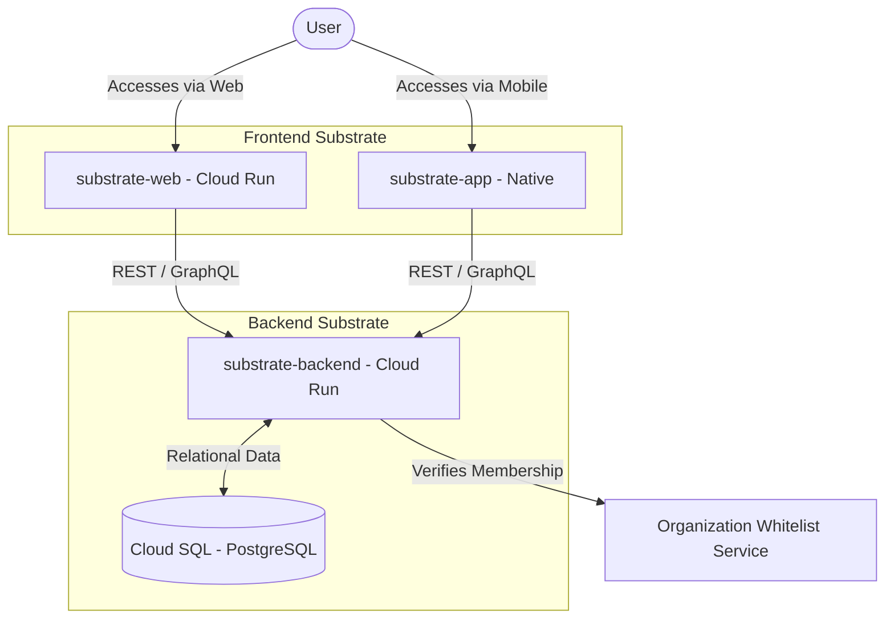
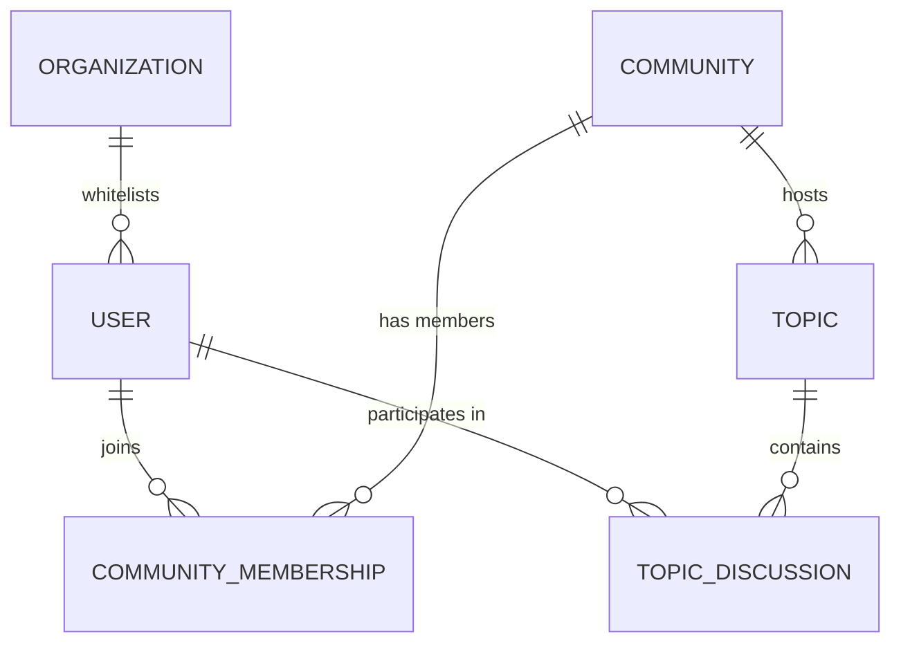

# System Architecture

The Operation Substrate Garden architecture is designed to be scalable, secure, and distributed across multiple interaction points (Web and App), all anchored by a robust backend.

## 1. System Overview

This diagram shows the primary components of the system and their high-level interaction.

## 2. Hosting Strategy: The Minimal Substrate

To ensure "Military Precision" from day one while maintaining cost-efficiency during the emergence phase, we utilize a **Serverless-First** approach for compute and a **Relational-First** approach for data.

- **Compute (Cloud Run):** Both the `substrate-web` and `substrate-backend` are hosted on Google Cloud Run. This allows for near-zero costs during low-traffic periods while providing instant scalability.
- **Data (Cloud SQL - PostgreSQL):** We explicitly choose **Cloud SQL** over NoSQL alternatives to maintain strict data integrity and support complex relational queries (Organizations -> Users -> Communities). 
  - *Minimal Configuration:* A `db-f1-micro` instance in `us-central1` provides the necessary "Architectural Substrate" for approximately ~$10/month.

## 3. Component Responsibilities

### substrate-backend
The central logic of the system. It is responsible for:
- **User Management**: Authentication, profiles, and organization verification.
- **Community Entities**: Managing community lifecycle (creation, updates, visibility).
- **Topic Entities**: Handling the hierarchy of topics within communities.
- **Security & Permissions**: Ensuring that users only see what they are authorized to see based on their "Tactical Meta-data."

### substrate-web
The primary desktop and browser-based interface.
- Follows the "Tactical Elegance" design system.
- Focuses on "Community Hub" and "Substrate Map" visualization for larger screens.

### substrate-app
The native mobile application for on-the-go access.
- Optimized for "Mobile Tactical Input Fields."
- Provides real-time notifications for topic updates within joined communities.

## 4. Core Domain Model

